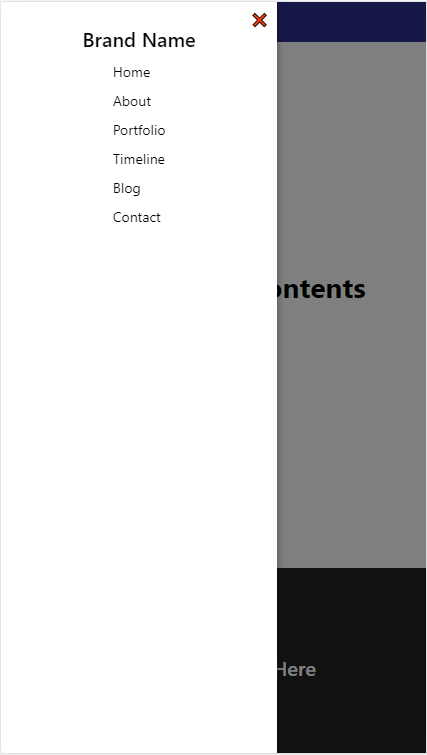
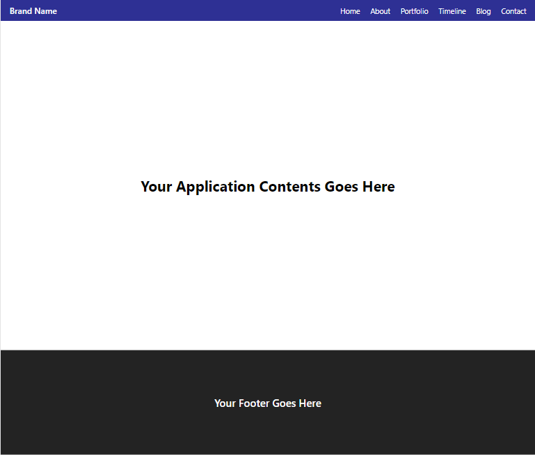

# ReactJS Responsive Sidedrawer
A ReactJS application with responsive sidedrawer feature. You can use this app as a react.js boilerplate also - if you like!

Project live on this [link](https://reactjs-responsive-sidedrawer.netlify.app/), check it out.

### Mobile View


### Desktop View


## Make your own copy ?
Please make sure you have installed NodeJS on your machine. Then -

First you need to clone the repository:
```
$ git clone https://github.com/robin3317/reactjs-responsive-sidedrawer.git
```

Then navigate to the project folder and you have to install the necessary dependencies using either NPM or Yarn(I'm using npm):
```
$ npm i
```

<br />
Now you are ready to run the application. The default port for development is 3000.

### To run the app
```
$ npm start
```

Now, if you visit [http://localhost:3000](http://localhost:3000), you will see that the application is up and running. Congratulation!

## License
MIT License. Use anywhere and do whatever you want to :)

## Conclusion
The application is created with lots of ♥. I know its a simple minimalistic responsive sidedrawer app, but you can customize or add new feature (such as animation) if you want. And you can use this as a react js boilerplate if you like the project structure. I appreciate your pull request(s), issue(s) and contribution.

[Abdur Rahman Robin](https://twitter.com/robin4java)
